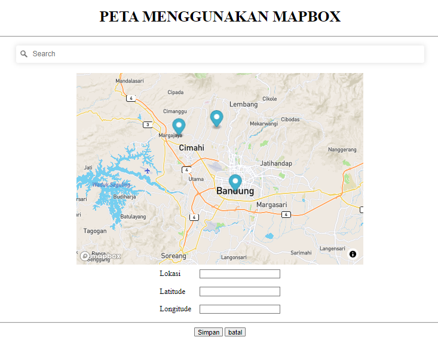

# Mapbox with Marker

Sebelumnya ini adalah tugas kuliah Aplikasi Teknologi Online. Aku menambahkan `database.php` `hapus.php` dan `.env`. Search lokasi lalu kita akan mendapatkan latitude dan longitude

# Cara Menjalankan

pastikan untuk menjalankan mysql/mariadb terlebih dahulu, Buka terminal lalu ketik perintah:

```
composer install
```

Ubah `.env.example` menjadi `.env` lalu isi sesuai konfigurasi :

```
host=localhost:3306
username=root
password=
database=mapbox
accessToken= MAPBOX_AKSES_TOKEN
```

terakhir, jalankan perintah di terminal:

```
php -S localhost:8080
```

Buka di browser dan ketik localhost:8080, akan tampil seperti gambar dibawah

# Screenshot


